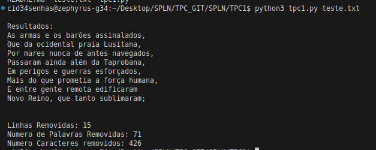
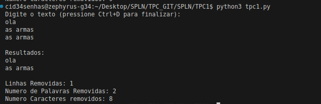

# TPC1 : Filtro Para Remover Linhas Repetidas


**Nome:** Gonçalo Araújo Brandão


**ID:** pg57874


## Descrição


O objetivo deste TPC era criar um filtro para remover linhas repetidas. Caso seja dado um ficheiro devemos remover as linhas repetidas sem mexer no ficheiro e devolver o resultado utilizando o ***stdout***. Caso não seja fornecido um ficheiro utilizamos o ***stdin***  e devolvemos o resultado por ***stdout***. Também devemos adicionar a este filtro uma pequena ferramenta nossa.


## Filtro


Para o nosso filtro começamos por criar uma main para lidar com a existência ou não de um ficheiro como argumento, guardando assim os dados numa variável ***data***.


De seguida criamos uma pequena função que divide o ***data*** em várias linhas e um pequeno ciclo for que ve se a linha atual já foi vista. Caso a linha seja nova é adicionada à lista de linhas originais, caso a linha seja repetida é adicionada a um conjunto de linhas repetidas.


A nossa ferramenta que decidimos implementar foi um word count das linhas repetidas encontradas. Para isto contamos o número de linhas removidas, o número de palavras nas linhas repetidas  e o número de caracteres nessas linhas. Fizemos uma função similar ao **wc** nativo dos sistemas operativos ***Unix***


## Como compilar


Input com ficheiro texto:
```
python3 tpc1.py teste.txt
````


Input sem ficheiro texto;
```
python3 tpc1.py
```

## Resultados 





