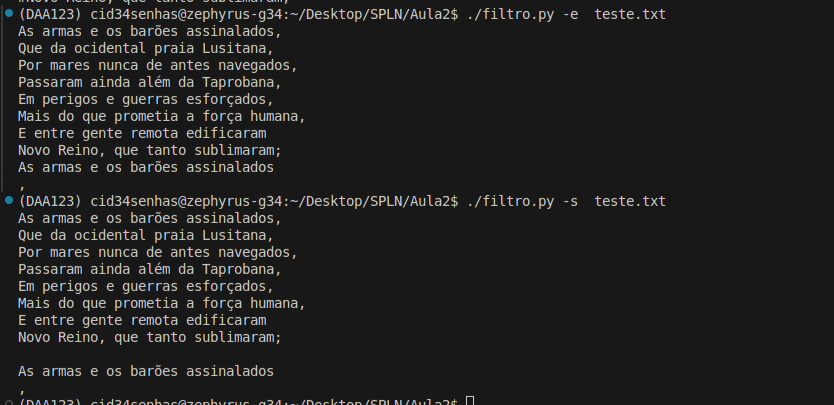

# TPC1 : Modificação do Filtro, adicionar a flag -p 

**Nome:** Gonçalo Araújo Brandão

**ID:** pg57874

## Descrição

O objetivo deste TPC deviamos alterar o filtro realizado durante a aula, adicionando-lhe a flag "-s" e "-p". 

A flag "-s" devia mantar os espacos antes e depois de cada ***string***  e remover as linhas duplicadas. 
Já a flag "-p" devia colocar as linhas repetidas em comentario com ***#*** 

## Implementação 

Para implementar esta leve alteração adicinei pequenas ***if clauses*** para lidar com os novos casos. 

## Resultados 

